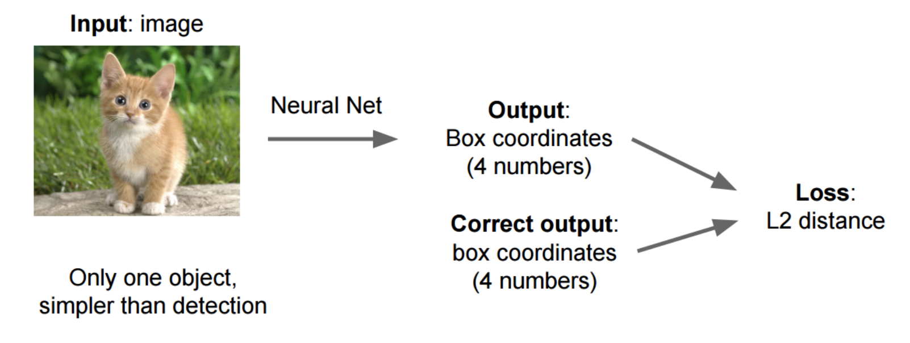
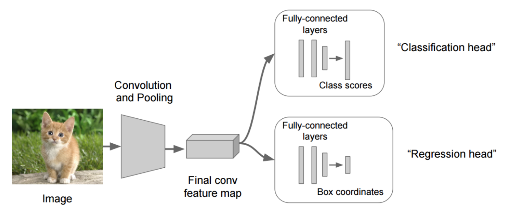
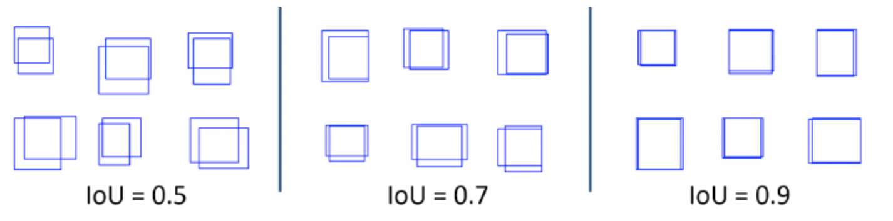
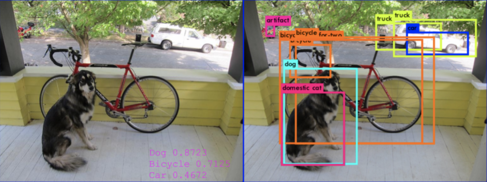
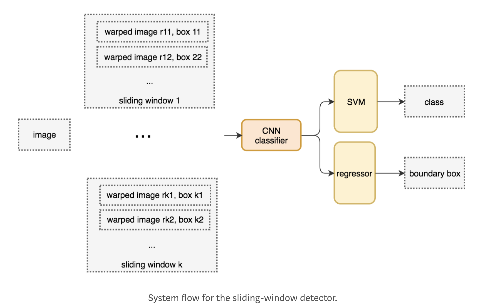
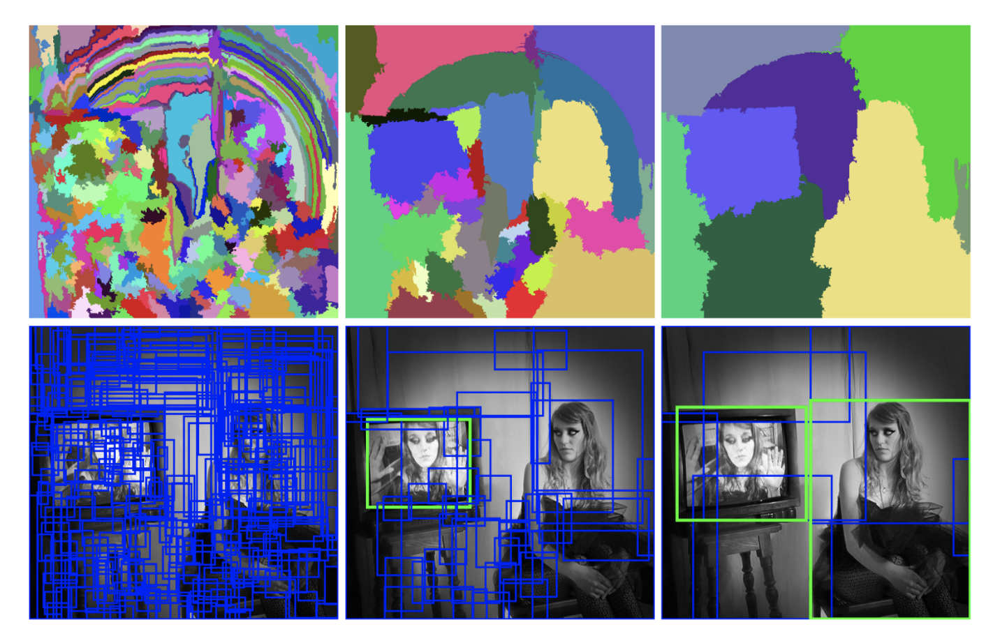
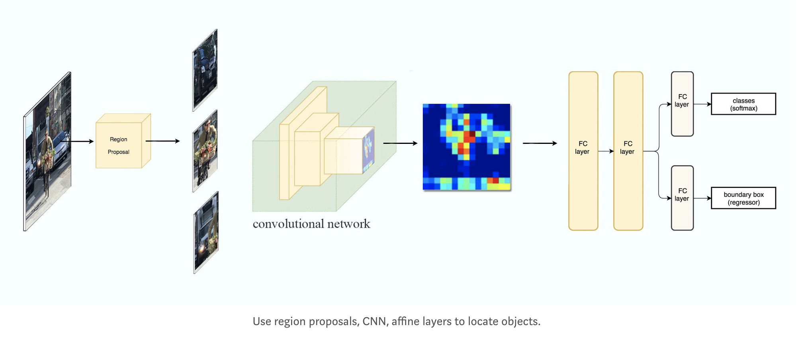
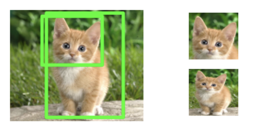
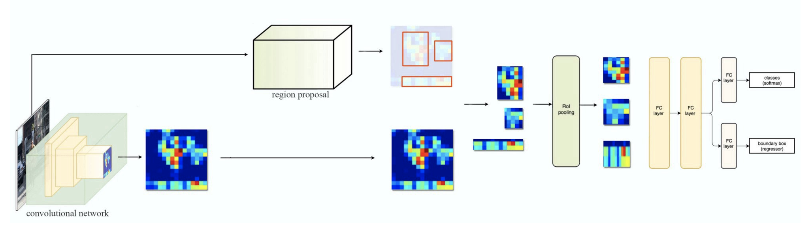

# Object detection methods

Datasets for object detection consists of images (X) and labels (Y). The labels are bounding boxes + class.

Classification+Detection examples:

* http://host.robots.ox.ac.uk/pascal/VOC/voc2012/examples/index.html
* http://www.image-net.org/download-bboxes

___
>**All feature extractors (CNN) in detection networks, consists of pre-trained ImageNet models, such as VGG, ResNet, or Inception.**
___
## Region based detectors

### Single object bounding box via. regression. (Classification + Localization)
Dataset consists of images labeled with class and bounding box.

    x_i = img
    y_i = (class), (x0, y0, width, height)

The image is passed into a CNN and features are extracted. Then fully connected layers to predict class (classification), and separate fully connected layers to predict bounding box parameters (regression).

Loss function for classification is cross-entropy and loss function for bounding boxes is regression loss such as mean squared error.

Performance metric for bounding box prediction is given by mean Average Precision (mAP) based on the Intersection-Over-Union (IoU).
(Todo: https://medium.com/@jonathan_hui/map-mean-average-precision-for-object-detection-45c121a31173)

    J = Intersection(box_hat, box) / Union(box_hat, box)

This method is only able to detect and single object in an image.

### Sliding Windows Region Proposal (Multi-object detection)
Multiple objects such as on the figure below requires more advanced methods.

One method is to use sliding windows:

A set of window sizes is chosen (n1xn1, n2xn2, n3xn3). The window sizes are smaller than the actual image. Each of the windows are slided over the image and for each slide a RCNN classifies the content of the window and regress the bounding box. This happens for all window sizes. The first windows that classifies as an object are chosen as bounding boxes.

This method is computationally expensive, and bounding boxes are not that accurate.

### More effective multiple object detecion with Selective Search RCNN.
Consists of a region proposal algorithm, and a CNN + FC to classify label and regress boxes for each region.

The region proposal algorithm (SS) works by bottom-up hierarchichal clustering of pixels based on color, texture, size, and shape. Regions are merged from bottom up until a specific amount of RoIs are found. Each regions is then classified and bounding box predicted.

The region proposal system is **Selective search (SS)**. The proposed regions are called Regions of Interest (RoIs).

SS proposes 2000 RoIs, and the RoIs are then warped into a fixes size quadratic image.

RoIs are fed into the CNN + FC to predict class and bounding boxes. The box regressor refines the bounding boxes in the RoIs.

### Faster-RCNN
Faster-RCNN replaces selective search with a **Region Proposal Network (RPN)**.

The RPN instead _learns_ which regions to propose, using neural networks. (TODO: https://medium.com/@tanaykarmarkar/region-proposal-network-rpn-backbone-of-faster-r-cnn-4a744a38d7f9)

[RPN Figure]

Instead of warping the RoIs into a fixed size image, the RoIs are passed into a _RoI Pooling_ layer.

[RoI Pooling Figure]

Each region is passed into the CNN + FC to classify and regress boxes.

## Single shot detectors

### YOLO

### SSD

# Region versus Single shot
Faster-RCNN is slower, but more accurate.

YOLO and SSD are much faster but less accurate.